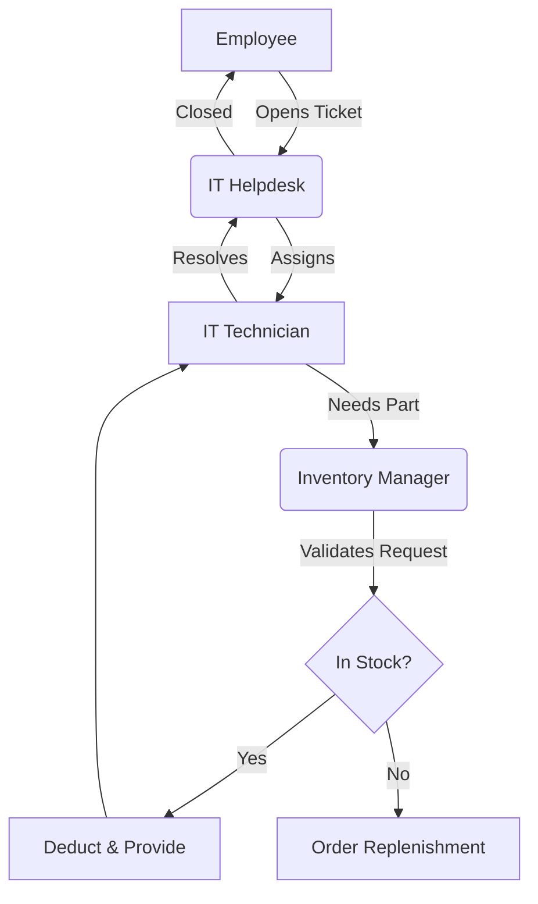
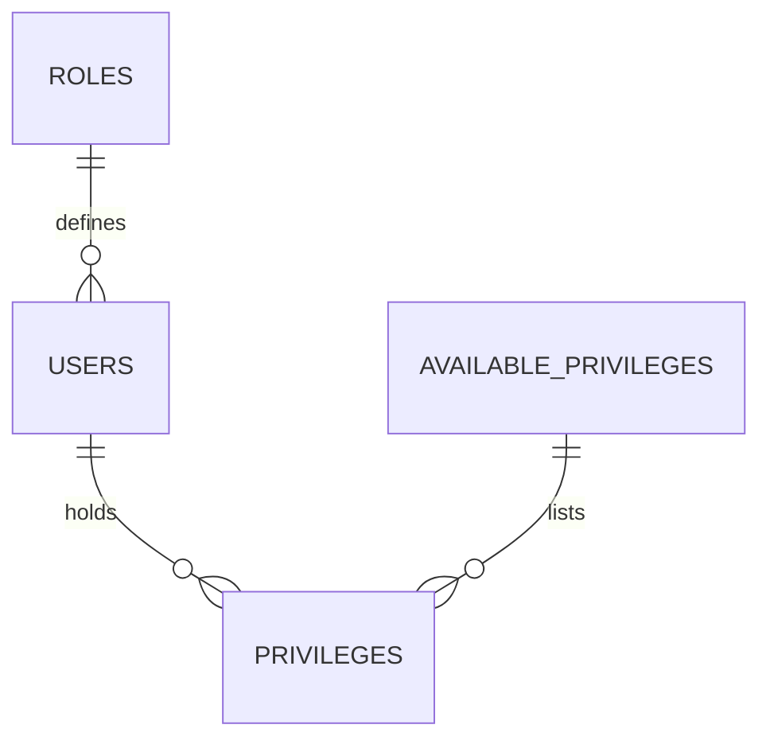

# TICKETING/INVENTORY SYSTEM: Defense Report
**Author**: DIEUBOUEN DEUTOU DUCLAIR ARMEL
**Subject**: HND in Software Engineering - Final Year Project
**Title**: Integrated Enterprise Ticketing & Inventory Optimization System

## 1. Project Overview
Eneo is a specialized Enterprise Resource Planning (ERP) tool designed for the ENEO Cameroon infrastructure. It addresses the fragmentation between IT support incidents and spare parts logistics. By integrating these workflows, the system reduces the "Mean Time to Resolution" (MTTR) for technical issues.

## 2. System Architecture
The application follows a **Decoupled Architecture**:

- **Presentation Layer**: A single-page application (SPA) built with Vanilla JavaScript, utilizing a premium "Glassmorphism" design language.
- **Service Layer**: A RESTful API built in PHP, providing secure endpoints for data manipulation.
- **Data Layer**: A MySQL database utilizing relational integrity and transaction-safe operations.

### 2.1 Process Flow (Mermaid Diagram)

## 3. Key Technical Implementations

### 3.1 Security Framework
- **Sessionless Auth**: Implemented via JSON Web Tokens (JWT).
- **Password Integrity**: Utilizing `PASSWORD_BCRYPT` with a cost factor of 10.
- **SQL Protection**: Forced use of prepared statements across all queries.

### 3.2 Dynamic RBAC (Role-Based Access Control)
Unlike traditional static systems, Eneo implements a **Dynamic Role Engine**. 

## 4. Problem Statement & Solution
**Problem**: Administrators previously had to modify database schemas to add new staff roles or permissions.
**Solution**: Developed the "System Config" module, allowing non-technical admins to define new organizational roles (e.g., "Human Resources") and granular system rights via the UI.

## 5. Conclusion
Eneo represents a robust, secure, and visually stunning solution for modern enterprise management. Its portable design ensures it can be deployed on any standard web server (Apache/Nginx) with zero configuration beyond the initial `setup.php` execution.
